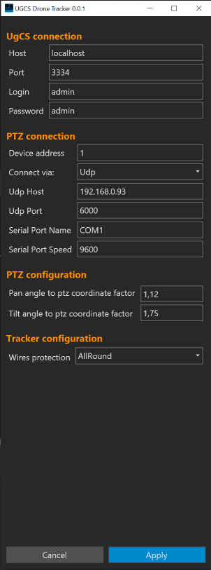
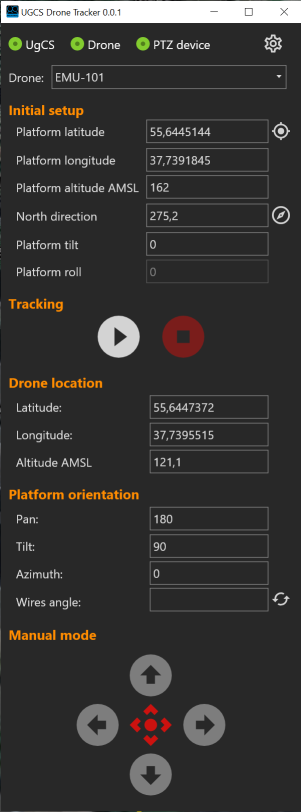

# Drone tracker

## 1) PTZ Probe

1.1) connect your ptz device to PC by serial port (rs485) or Ethernet (udp)

1.2) start PTZDevice probe tool:

for serial port connection:

```
PTZDeviceProbe.exe -t serial -serial-name PORT_NAME -serial-speed PORT_SPEED
	where:
		-t serial - serial connection type
		-serial-name - serial port name (default=COM1)
		-serial-speed - serial port speed (default=9600)
	example:
		PTZDeviceProbe.exe -t serial -serial-name COM4 -serial-speed 9600
		or
		PTZDeviceProbe.exe -t serial -serial-name COM4
```		

for ethernet connection:

```
PTZDeviceProbe.exe -t udp -host HOST -port PORT
	where:
		-t udp - serial connection type via udp
		-host - udp host (default=192.168.0.93)
		-port - ptz udp port (default=6000)
	example:
		PTZDeviceProbe.exe -t udp -host 192.168.0.93 -port 6000
```
log files are located in probe tool "Logs" subfolder (./Logs/).


1.3) check tool output. there is should be something like this:

```
UGCS DroneTracker - PTZ Probe tool
Initialize transport...
Transport initialized
Create PTZ device controller
PTZ device controller created
Try to request current pan...
Request current pan done, Current Pan=321,41964285714283
Try to request current tilt...
Request current tilt done, tilt=51,42857142857143
Try to request max pan...
Request max pan done, Max Pan=40319
Try to request max tilt...
Request max tilt done, Max Tilt=23625
Try to set pan by 0x71 opCode
Try to request set pan to 20159...
Request set pan done
Try to request set pan to 40319...
Request set pan done
Try to request set pan to 0...
Request set pan done
Try to request set pan to 32141...
Request set pan done
Try to set pan by 0x4B opCode
Try to request set pan to 20159...
Set pan request cancelled by timeout
... <skiped>
Set pan request cancelled by timeout
Try to set tilt by 0x73 opCode
Try to request set tilt to 11812...
Request set tilt done
Try to request set tilt to 23625...
Request set tilt done
Try to request set tilt to 0...
Request set tilt done
Try to request set tilt to 5142...
Request set tilt done
Try to set tilt by 0x4D opCode
Try to request set tilt to 11812...
Set tilt request cancelled by timeout
... <skiped>
Try to request set tilt to 5142...
Set tilt request cancelled by timeout

Done.
Press enter to exit...
```

now, lets do some analysis:

1.3.1) check line (6) ```Try to request current pan...```
if after this line you see something besides ```"Request current pan done, Current Pan=SOME_VALUE"``` - this is bad, check log files.

1.3.2) do same for lines:

* ```"Try to request current tilt..."``` - should be ```"Request current tilt done, tilt=SOME_VALUE"```
* ```"Try to request max pan..."``` - ```"Request max pan done, Max Pan=SOME_VALUE"```
* ```"Try to request max tilt..."``` - ```"Request max tilt done, Max Tilt=SOME_VALUE"```

1.3.3) if all is ok - remember values of maximum Pan/Tilt PTZ coordinates. in my example this is MaxPan = 40319, MaxTilt = 23625.

1.3.4) check lines from ```"Try to set pan by 0x71 opCode"``` to ```"Try to set pan by 0x4B opCode"```. if every request (```"Try to request set pan to 20159..."``` and so on) has response ```"Request set pan done"``` - here we are happy, ignore 1.3.5 and proceed to 1.3.6.

if in this lines every request has response ```"Set pan request cancelled by timeout"``` - proceed to 1.3.5.

1.3.5) check lines from ```"Try to set pan by 0x4B opCode"``` to ```"Try to set tilt by 0x73 opCode"```. if every requests here have responses ```Request set pan done``` - this is good, but before using DroneTracker tool some configurations should be made (see paragraph 2.7).

if in this lines every request has response ```"Set pan request cancelled by timeout"``` - this is bad. in this case - check logfiles.

1.3.6) check lines from ```"Try to set tilt by 0x73 opCode"``` to ```"Try to set tilt by 0x4D opCode"```. same as in 1.3.4, if you see ```"Request set pan done"``` - proceed to 1.4.

1.3.7) check lines from ```"Try to set tilt by 0x4D opCode"``` to ```"Done"```. same as in 1.3.4, if you see ```"Request set pan done"``` - ok, but we need some configuration (see paragraph 2.7), else - send logfiles to me.

1.4) now lets do some math

1.4.1) calculate pan angle to PTZ coordinates factor:

```
Kpan = MaxPanCoordinate / abs(MaxPanAngle - MinPanAngle) / 100,
where:
    MaxPanCoordinate - max pan value from 1.3.2,
    MaxPanAngle, MinPanAngle - inclusive min/max PTZ device pan angles from specification
    with 2 sign float point precision (for continuous pan they are - 0, 359.99 ).
example (for my case):
    Kpan = 40319 / abs(359.99 - 0) / 100;
    Kpan = 1.12
```

1.4.2) calculate tilt angle to PTZ coordinates factor:

```
Ktilt = MaxTiltCoordinate / abs(MaxTiltAngle - MinTiltAngle) / 100,
where:
    MaxTiltCoordinate - max tilt value from 1.3.2,
    MaxTiltAngle, MinTiltAngle - inclusive min/max PTZ device tilt angles from specification
    with 2 sign float point precision.
example (for my case):
    Ktilt = 23625 / abs(-90 - 45) / 100;
    Ktilt = 1.75
```

## 2) UgCS Drone tracker setup

2.1) start DroneTracker-AV.exe and proceed to settings page (cogs icon in in the upper right corner).



2.2) set up UgCS connection parameters

2.3) setup PTZ device connection parameters:

* ptz device address (1-63), usually 1 - check this value in ptz device settings.
* select your connection type (serial port/udp)
* for serial port connection provide serial port name and speed
* for udp connetion type provide host and port

2.4) PTZ configuration

set here values from 1.4.1 and 1.4.2

2.5) Tracker configuration

select anti-twist wires protection (All round / Disabled).

* disabled - no wires protection
* all round - if during the tracking process the device rotates in one direction at an angle greater than 360, then a corrective rotation will be performed in the opposite direction.

2.6) setup finished! press "Apply" and close application (changing settings requires application restart).

2.7) if in section 1 you had cases 1.3.5 and 1.3.7 then you need some additional configuration. open DroneTracker user config file (see location in section 4) in any editor. find section with Pelco-D codes mapping:

```json
  "PelcoCodesMapping": {
    "Stop": 0,
    "TiltUp": 8,
    "TiltDown": 16,
    "PanLeft": 4,
    "PanRight": 2,
    "SetPan": 113,
    "SetTilt": 115,
    "RequestPan": 81,
    "RequestTilt": 83,
    "SetPanCompleteResponse": 124,
    "SetTiltCompleteResponse": 124,
    "RequestPanResponse": 97,
    "RequestTiltResponse": 99
  },
```

change lines:

* ```"SetPan": 113,``` to ```"SetPan": 75,```
* ```"SetTilt": 115,``` to ```"SetTilt": 77,```

save config file.

## 3) Drone tracking

3.1) start UgCS Client, make all preparations for working with the drone.

3.2) start DroneTracker: DroneTracker-AV.exe



3.3) check UgCS server connection (should be green). if there is no connection (red) - check app settings.

3.4) select drone to track (target drone) from combobox or in UgCS client.

3.5) set up ptz device location (latitude, longitude, altitude amsl) in "Initial setup" section. you can take these values from target drone ("Drone location" section) by pressing corresponding button (right of the field "Platform latitude").

3.6) set up North direction relative to the zero coordinate of PTZ device (from 0 to 359.99 clockwise from PTZ zero). you can set this value from current PTZ pan angle by pressing corresponding button (right of the field "North direction").

3.7) if you need, set up platform tilt - degrees from horizon.

3.8) initial platform roll not yet supported

3.9) press start button. if all is ok - ptz should start keep track of drone. after ypu are done - press stop button.

3.10) to use manual mode, press "Gain / Release control" button (center of manual mode section). now you can control ptz device manualy by press and hold direction buttons. to exit from manual mode - press center button again. manual mode is not available during tracking is on.

## 4) User app data

user config file and log files directory you can locate in ```{LOCALAPPDATA}/UGCS-DroneTracker/```, e.g ```C:\Users\USER_NAME\AppData\Local\UGCS-DroneTracker```.

